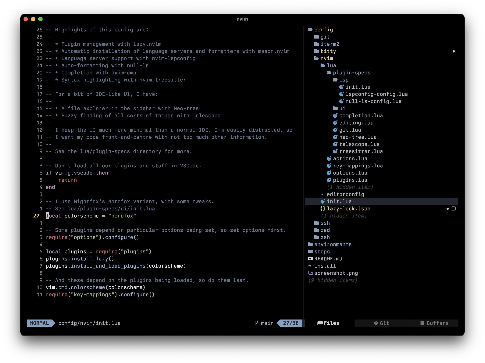

# Pete's dotfiles



This does 80% of the work of setting up a Mac the way I like it:

```sh
xcode-select --install
git clone git://github.com/notahat/dotfiles ~/.dotfiles
cd ~/.dotfiles
export DOTFILES_ENV=home
./install
```

I re-run `./install` frequently (it's idempotent), which ensures I maintain it.

I remove anything I'm not using to keep it simple.

## What's Installed?

A whole bunch of things, but key components are:

- [Neovim](https://neovim.io). I've got a [pretty fancy setup](config/nvim).
  It's got lots of IDE features, but is a lot cleaner than other IDEs I've
  used. My config is extensively commented. Starts up in about 100ms.
- [Zsh](https://zsh.org) config. I like it fast (so none of this [Oh My
  Zsh](https://ohmyz.sh) nonsense), but with a nice prompt and completion. Also
  starts up in about 100ms.
- [Kitty](https://sw.kovidgoyal.net/kitty/). It's fast, configurable, and has
  great documentation.
- [Homebrew](https://brew.sh) installs anything where I always want the latest
  version, including apps from the Mac App Store.
- [Mise-en-place](https://mise.jdx.dev/) manages things like languages, where I
  want particular versions installed.

## How It Works

`./install` runs steps from the `steps` directory. You can run individual
steps, or the whole set. See `./install -h` for usage.

All my config files live under `config`. These get soft-linked into place by
the steps.

The `environments` directory contains separate `Brewfile`s and `mise.toml`
files for my home and work machines.
